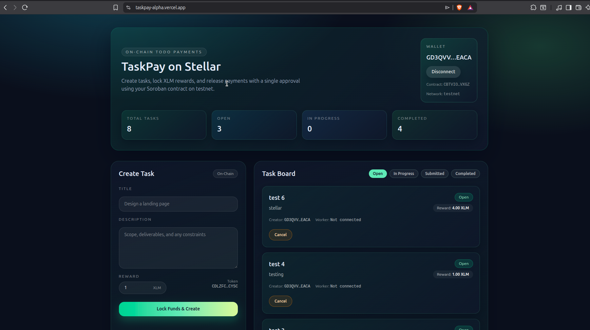
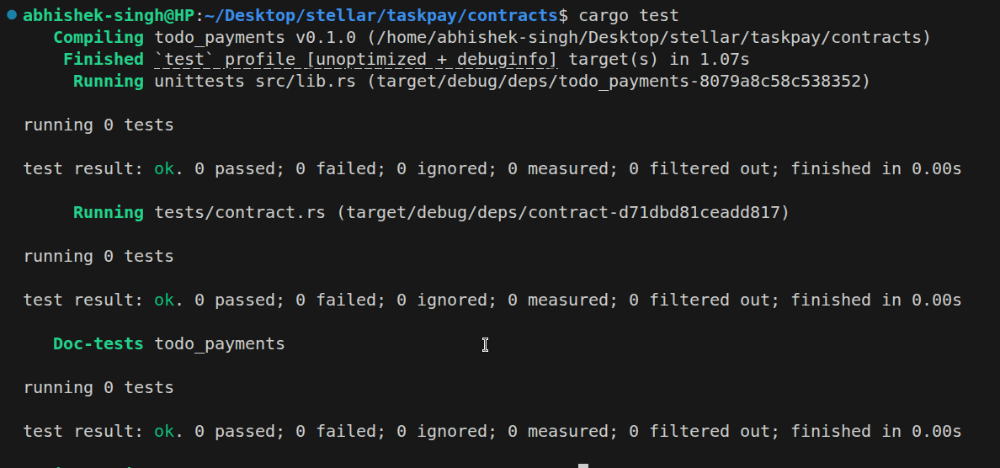

# TaskPay — On‑Chain Todo Payments (Stellar + Soroban)

A minimal on‑chain task marketplace where creators lock XLM rewards and workers get paid automatically after approval. Built on Stellar Soroban with a clean Next.js frontend.

## Live Demo
- **Live**: https://taskpay-alpha.vercel.app/
- **Demo video**: https://drive.google.com/file/d/1fWapCJDgQsDRnfY15f9zmhARU3McD7hj/view?usp=sharing

## Screenshots


## Test Output (3+ Passing)


## Core Features
- Create task with locked XLM reward
- Accept, submit, approve & pay flows
- On‑chain task status transitions
- Freighter + multi‑wallet support via Stellar Wallets Kit
- Transaction toasts and status indicators
- Task list read directly from Soroban contract

## Smart Contract Flow
**State machine:** `OPEN → IN_PROGRESS → SUBMITTED → COMPLETED` (plus `CANCELLED`)

**Key methods:**
- `init(token)`
- `create_task(creator, title, description, reward)`
- `accept_task(worker, task_id)`
- `submit_task(worker, task_id)`
- `approve_task(creator, task_id)`
- `cancel_task(creator, task_id)`

## Tech Stack
- **Soroban**: Rust smart contract
- **Frontend**: Next.js App Router + Tailwind
- **Wallets**: Stellar Wallets Kit (Freighter, Albedo, etc.)
- **RPC**: Soroban RPC (testnet)

## Project Structure
- `contracts/` — Soroban smart contract + tests
- `src/app/` — Next.js UI
- `src/components/` — UI components
- `src/lib/` — helpers and shared types

## Local Development
### 1) Frontend
```bash
npm install
npm run dev
```

### 2) Contract Tests
```bash
cd contracts
cargo test
```

### 3) Contract Build
```bash
cd contracts
stellar contract build
```

## Environment Variables
Create `.env.local` in the project root:

```bash
NEXT_PUBLIC_TASKPAY_CONTRACT_ID=CBTVIOUWGM7VHQPXLLFKZNCUK2W7XRWFGWSYIMQO2EL4ZGYWZW3RVXGZ
NEXT_PUBLIC_TASKPAY_NATIVE_TOKEN_ID=CDLZFC3SYJYDZT7K67VZ75HPJVIEUVNIXF47ZG2FB2RMQQVU2HHGCYSC
NEXT_PUBLIC_TASKPAY_NETWORK=testnet
NEXT_PUBLIC_STELLAR_RPC_URL=https://soroban-testnet.stellar.org
NEXT_PUBLIC_HORIZON_URL=https://horizon-testnet.stellar.org
NEXT_PUBLIC_STELLAR_NETWORK_PASSPHRASE=Test SDF Network ; September 2015
NEXT_PUBLIC_READONLY_ACCOUNT=YOUR_TESTNET_PUBLIC_KEY
```

## Deployment
This project is deployed on Vercel:
- https://taskpay-alpha.vercel.app/

---

If you want enhancements or help reviewing on‑chain security, open an issue or reach out.
